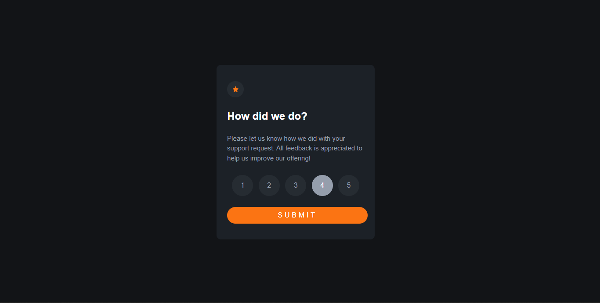
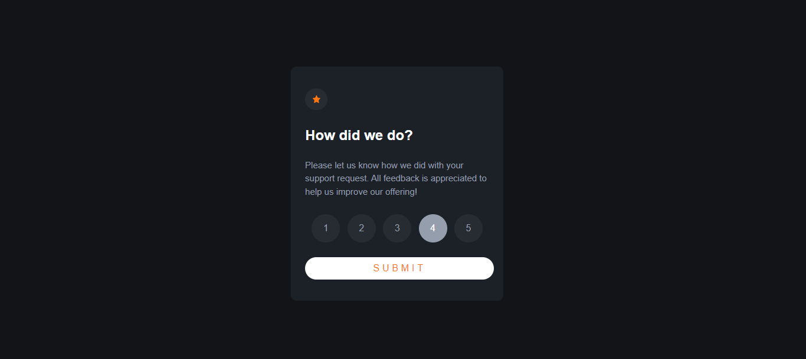
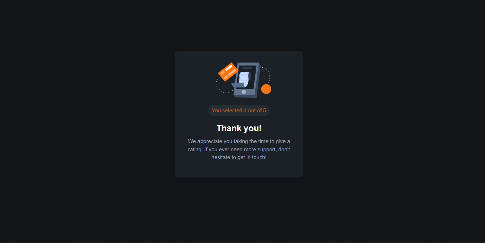
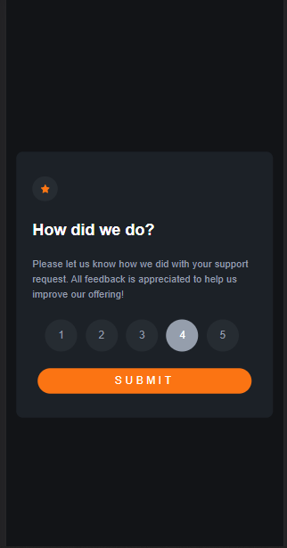
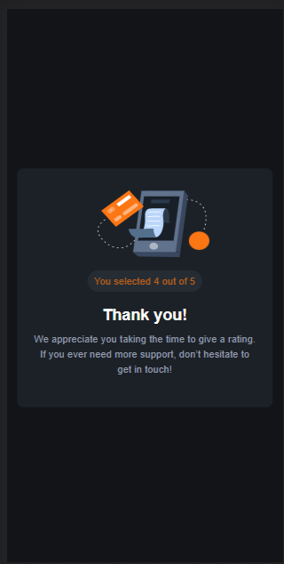

# Frontend Mentor - Interactive rating component solution

This is a solution to the [Interactive rating component challenge on Frontend Mentor](https://www.frontendmentor.io/challenges/interactive-rating-component-koxpeBUmI). 

## Table of contents

- [Overview](#overview)
  - [The challenge](#the-challenge)
  - [Screenshot](#screenshot)
  - [Links](#links)
- [My process](#my-process)
  - [Built with](#built-with)
  - [What I learned](#what-i-learned)
  - [Continued development](#continued-development)
- [Author](#author)

## Overview

### The challenge

Users should be able to:

- View the optimal layout for the app depending on their device's screen size
- See hover states for all interactive elements on the page
- Select and submit a number rating
- See the "Thank you" card state after submitting a rating

### Screenshot

### Links

- Solution URL: [Solution](https://github.com/kurokurotho/kurokurotho.git)
- Live Site URL: [https://your-live-site-url.com](https://kurokurotho.github.io/kuor.github.io/)

## My process

### Built with

- Semantic HTML5 markup
- CSS custom propertie
- CSS Grid

### What I learned

this challenge helped to understand not to add unneccessary thing in the solution.

### Continued development

i done this challenge using only css and html as I still have to learn about javascript .In future i will be recreating this using javascript.

## Author

- Frontend Mentor - [deo](https://www.frontendmentor.io/profile/kurokurotho)

